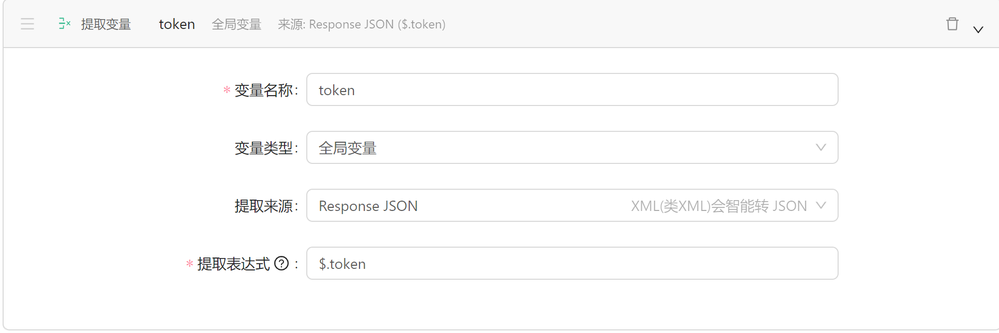

# 后端贡献代码说明

[toc]

## 代码规范

**必须遵守 [Google Java Style Guide](https://google.github.io/styleguide/javaguide.html)**

- 对于 `IntelliJ IDEA`，你可以使用 [intellij-java-google-style.xml](https://github.com/google/styleguide/blob/gh-pages/intellij-java-google-style.xml) 来快速导入 `IntelliJ IDEA Code Style XML`

    > 导入方法：`Preferences` -> `Editor` -> `Code Style` -> `Java` -> ⚙ -> `Import Scheme` -> `IntelliJ IDEA Code Style XML`
    >
    > 导入后选择 `GoogleStyle` 即可，在格式化代码时 (Windows/Linux: `Ctrl` + `Alt` + `L`, macOS: `command` + `option` + `L` ) 将会按照所选的代码风格格式化代码。

- 对于 `Eclipse`，你可以使用 [eclipse-java-google-style.xml](https://github.com/google/styleguide/blob/gh-pages/eclipse-java-google-style.xml) 来快速导入格式化配置文件

在 commit/push 之前请先格式化代码

## API 设计规范

**必须遵守 [Representational state transfer (REST)](https://en.wikipedia.org/wiki/Representational_state_transfer) 规范（特殊情况另行商议）**

> 参考资料：
>
> 1. [怎样用通俗的语言解释REST，以及RESTful？ - 知乎 (zhihu.com)](https://www.zhihu.com/question/28557115/answer/48094438)
> 2. [Getting Started | Building a RESTful Web Service (spring.io) REST 样例](https://spring.io/guides/gs/rest-service/)
> 4. **[Tutorial | Building REST services with Spring（有助于实战编写符合 REST 的项目，但是较长，建议放最后看）](https://spring.io/guides/tutorials/rest/)**
> 5. [What is REST (restfulapi.net)](https://restfulapi.net/)

### Apifox 文档规范

#### 新建接口

从 API 文档中找到自己要开发的功能，查看相关信息，新建 Apifox 接口。

##### 基础信息

- 接口类型：同文档中规定的类型，常用`GET` `POST` `PUT` `DELETE` 等
- 接口路径：`/版本号/功能路径` 从文档中获取信息，例如 `v1/auth/login`
- 名称：`功能编号 功能要点` ，例如 `AU01 登录`
- 分类：`/版本/功能大点`，例如 `/v1/AU 权限`
- 状态：默认为 `开发中`
- 责任人：默认为 自己（开发这个端口的人）
- 标签：按实际权限填写，常用 `all` `authenticated` `user` `admin` `me`等，具体用法见后文
- 说明：有需要额外说明的注意事项

##### 关于 `标签` 

| 标签            | 解释             |
| --------------- | ---------------- |
| `all`           | 所有人均可以访问 |
| `authenticated` | 需要权限验证     |
| `user`          | 普通用户有全权限 |
| `admin`         | 管理员用户有权限 |
| `me`            | 个人用户有权限   |

- 需要权限认证的接口都应该加上 `authenticated` 标签
- 原则上 `user` 有权限的接口，`admin` 也有权限
- 举例来说 `US0101 获取用户列表` 接口，需要管理员权限那么他的标签应该为`authenticated` 和`admin` 权限

##### 请求参数

- `Query参数`：一般用于 `GET` 和 `DELETE` 请求
- `Body参数`：一般用于 `POST` 和 `PUT` 请求
  - 格式选择 `json`
  - 数据结构：可以使用 `JSON 智能识别 ` 功能帮助创建
  - 数据结构：常用的数据类型可以存储为 `数据模型`
  - 示例值：挑选一组经典的数据作为示例

##### 返回Response

- 根据实际情况启用 `全局 Response`
- 根据实际情况增加类型
- 自定义的返回必须创建`返回 Response 示例`，全局 Response 按需创建

####  测试

##### 测试环境

由于接口访问大多需要 `Header - Authorization`， 若一个个添加未免过于麻烦，我们可以使用 Apifox 提供的测试环境功能。

1. 在 窗口右上方 点击 按钮 进入 `全局参数` 的管理界面
2. 在 `Header` 中添加 `Authorization` 参数
3. 填写默认的 `token` 值，推荐使用动态的 `Bearer {{token}}`，其中 `token` 为全局变量
4. 全局变量 `token` 的数值可以通过后置脚本自动更新，具体介绍见 `脚本`

##### 测试数据

点击 `运行` 界面的 `🔄自动生成` ，会根据配置的 `Mock`  随机生成数据

##### 测试用例

对于常用的、经典的数据，应当点击 `保存为用例`，并命名为 `状态码-情况` ，方便之后调用

例如对于 `AU01 登录接口`，登录管理员是一个常用的用例，则其可以保存为 `201-登录管理员`

##### 脚本

>  [脚本介绍 | Apifox 使用文档](https://www.apifox.cn/help/app/scripts/)

我们可以通过脚本进行各种自动操作

例如我们想在登录后自动更新  `token`，这属于 `后置操作` 也就是返回结果后进行的操作，可以这样操作：

### 其他注意点

- 每个 API 需要有对应的 Apifox 文档和测试用例

## 参考资料

1. [Spring Boot 2.0 — Project Structure and Best Practices (Part 2) 项目结构说明](https://medium.com/the-resonant-web/spring-boot-2-0-project-structure-and-best-practices-part-2-7137bdcba7d3)
2. [Getting Started | Accessing Data with JPA (spring.io) JPA 样例](https://spring.io/guides/gs/accessing-data-jpa/)