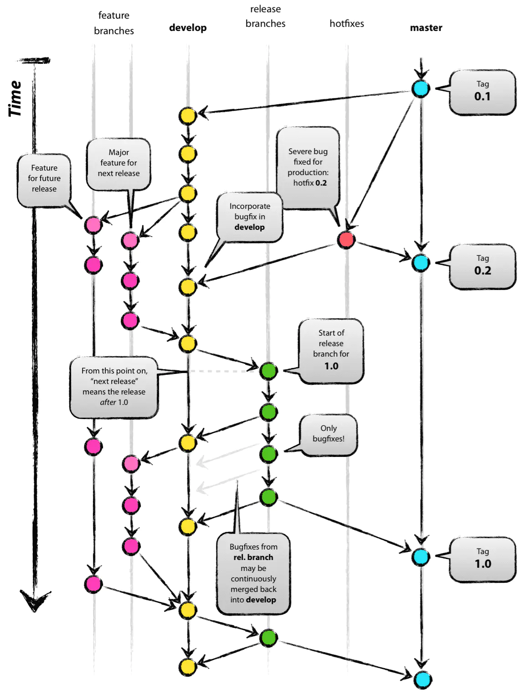

# Frogsoft CMS 代码贡献说明

## Git 使用规范

### Commit 规范

每一个 Git commit message 由 **header** 和 **body** 组成。

```
<header>
<BLANK LINE>
<body>
```

>  如果你使用 `IntelliJ IDEA`，可以使用插件 `Git Commit Template` 来辅助书写 commit message 

#### **header**

header 是必须的，格式如下：

```
<type>(<scope>): <short summary>
  │       │     │     │
  │       │     │     └─⫸ 原则上使用英文；使用动词原形开头，首字母不需要大写，句尾不需要句号（整句尽量不超过60词）
  │       │     │ 
  │       │     └─⫸ 冒号后面需要一个半角空格
  │       │ 
  │       └─⫸ Commit Scope: backend|frontend-admin|frontend-user
  │
  └─⫸ Commit Type: build|ci|docs|feat|fix|perf|refactor|test|style|chore|revert
```

##### Commit Type

* **build**: 影响构建系统或者外部依赖的更改，例如修改 `pom.xml`, `Dockerfile`, `docker-compose.yml` 的更改
* **ci**: 影响到 CI 配置或脚本的更改，例如修改 `gitlab-ci.yml`, Github Actions 的配置文件等
* **docs**: 只修改了文档的更改
* **feat**: 增加新功能的更改
* **fix**: 修复 bug  的更改
* **perf**: 提高了程序性能的更改
* **refactor**: 既没有修复 bug 也没有增加新功能的更改（比如重构代码）
* **test**: 增加或改正测试代码
* **style**: 不改变代码含义的修改（比如格式化代码）
* **chore**: 其他不改变 `src` 或测试代码的修改
* **revert**: 撤回之前的 `commit`

#### scope

commit 所属的范围

- backend 后端
- frontend-admin 前端（管理员）
- frontend-user 前端（用户）

如果 commit 不属于以上范围，则不用加 scope
#### body

body 是可选的，与 header 一样，需要使用动词原形。body 中可以书写比 header 中更详细的信息，比如：

- 为什么做了这个更改
- 受到了什么启发
- 与之前版本的区别
- 功能的详细说明
- ……

#### 样例

```
fix: address an issue where return value can be null

if an incorrect request body is sent to the server, method xxx may respond with a empty body due to xxx
this issue is fixed by improving error handling in the request parser
```

### Branch 规范

#### Branch 类型

 所有的 `branch` 分为五种类型：

- `master` 分支：主分支，发布项目的每一个稳定版本
- `develop` 分支：开发分支，项目开发过程中的最新版本
- `release` 分支：预发布分支*，在正式发布前的测试版本，命名为 `release-YYYYMMDD-版本号` 
- `feature` 分支：功能分支*，项目的每一个功能都需要有单独的一个feature分支，命名为 `feature-功能编号` 
- `hotfix` 分支：热修复分支*，修复已发布版本中存在的bug，命名为`hotfix-YYYYMMDD-bug关键字`

> 带*的分支为临时性分支，一旦完成开发，他们就会被合并，随后删除。

#### Branch 使用流程



#### 开发新功能

1. 从需求文档中了解新功能的各项要求
2. 从 `develop` 分支中创建新的功能分支，并命名为 `feature-功能编号` 
3. 进行功能开发
4. 进行测试与修复bug
5. 使用 `pull request` 将本分支合并至 `develop` 分支，随后删除本分支

#### 预发布版本

1. 从最新的 `develop` 分支中创建预发布分支，并命名为 `release-YYYYMMDD-版本号` 
2. 进行测试，并进行bug修复。（不允许开发新功能）
3. 使用 `pull request` 将本分支合并至 `develop` 分支。（保存修复bug的代码）
4. 使用 `pull request` 将本分支合并至 `master` 分支。（正式发布该版本）
5. 删除该分支

#### 修复 bug

##### 开发过程中

直接在所在的 `branch` 中提交相应的 `fix` 

##### 版本上线后

1. 创建 bug 对应的 `hotfix` 分支，命名为 `hotfix-YYYYMMDD-bug关键字` 
2. 修复 bug ，并提交 fix 类型的 commit
3. 使用 `pull request` 将本分支合并至 `master` 分支。（修复正式环境）
4. 使用 `pull request` 将本分支合并至 `develop` 分支。（保存修复bug的代码）
5. 删除该分支

### Merge 规范

- 在尝试合并发生冲突时，必须人工解决冲突，禁止 `git push -f` 或在不阅读冲突代码的情况下直接采用一方代码

