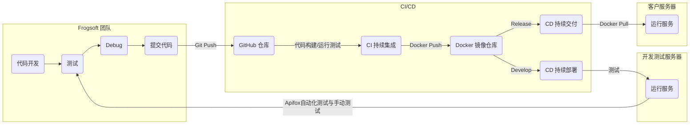
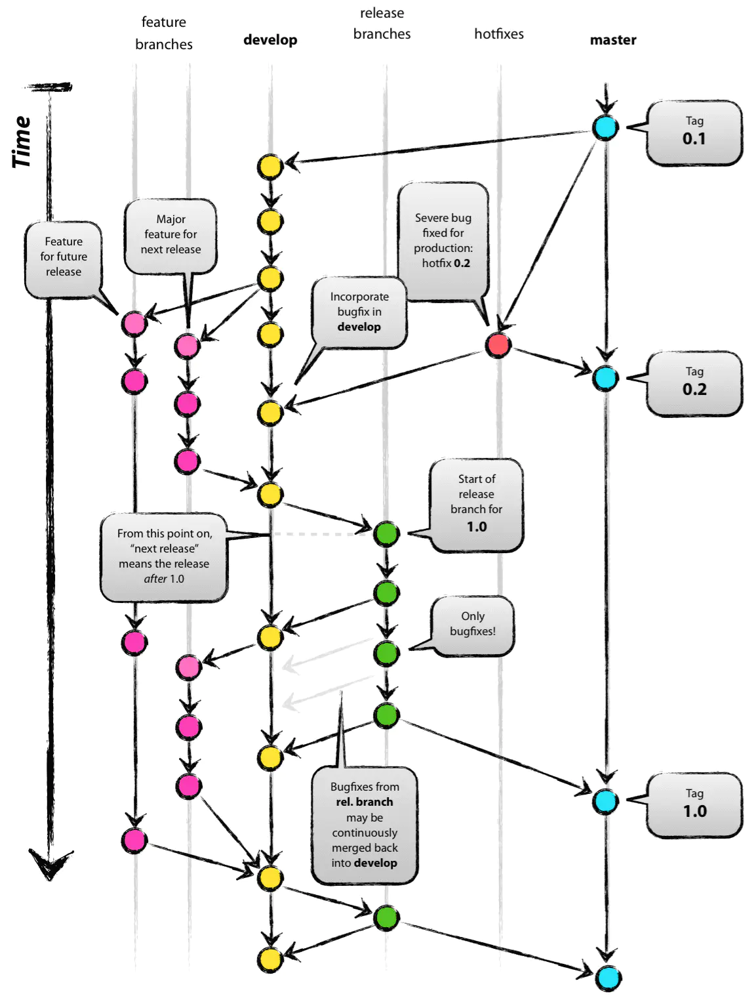

[toc]

# 产品运行要求

## 客户端

任意能够运行以下浏览器之一并拥有互联网访问权限的计算机，不限操作系统与处理器架构

- Firefox `>= 85`

- Chrome/Microsoft Edge `>= 88`
- Safari `>=12`

## 服务端

我们的服务采用 `Docker` 镜像进行分发与部署，与传统部署方式相比，这极大程度上简化了部署要求，仅需简单的配置即可运行服务，普通用户也能简单上手。

由于我们的整套服务需要提供给客户，这种方法将客户从 0 开始部署服务的过程缩短至一杯咖啡的时间，降低我们客户的上手成本，提高我们产品的用户体验。

### 具体部署要求如下：

#### 共性要求

> 几乎所有近 15 年的 Linux 服务器与近 6 年的个人计算机均能满足需求

- 可以运行 `Docker` 的计算机

- 处理器架构必须是 `x86`，`x86_64/amd64`, `aarch64` 之一
- 建议空闲内存 `>= 1 GB`
- 建议空闲磁盘空间 `>= 8 GB`
- 良好的互联网接入

#### 操作系统具体要求

- Linux

    - Ubuntu / CoreOS / Debian / CentOS / Fedora 及其他被 `Docker` 支持的发行版
    - 遵循共性要求

- Windows

    - 家庭版或专业版：版本号 `>= 2004`, build `>=19041`；

        企业版或教育版：版本号 `>= 1909`, build `>=18363`

    - 必须是 `x86_64` 架构处理器，且需要支持二级地址转换技术，即可以启用 Hyper-V

    - 系统内存 `>= 4 GB`

- macOS

    - Intel x86_64 处理器
        - 系统版本 `>=10.14`
        - 系统内存 `>= 4 GB`
    - Apple Silicon 处理器
        - 需要安装 Rosetta 2 来使用 x86_64 镜像


# 产品开发流程与技术

## 简要开发流程

我们团队设计开发流程时考虑到需要尽量接近企业产品开发，所以我们一开始便选择了遵循 `DevOps` 模型。

这是一套开发理念、流程和工具的集合，旨在缩短产品开发周期、提供比传统开发模式更快速的持续交付 (Continuous Delivery) 并且不损失软件质量。

由于我们是一个 6 人的小团队并且时间紧张，我们对 `DevOps` 进行部分调整后设计的整个软件开发流程如下：



传统的代码开发流程不再赘述，下面介绍我们的特点。

我们利用 `GitHub Action` 进行代码的持续集成 (`CI`)与部署 (`CD`)，大幅降低服务器运维的工作量，开发者仅需提交代码。开发者代码提交后提交 Pull Request，每个 Pull Request 经过 Peer Review 后将合并至 `develop` 分支，此时进行 `CI/CD` 整个流程，开发服务器将部署测试代码进行进一步的测试；测试代码达到发布的要求后将相关的代码合并至 `master` 分支，`CI/CD` 通过后，此时 Release 发布完成，客户将从镜像仓库获得 Release 版本的镜像。

## 开发流程中的规范

> 以下内容在我们的代码仓库中均有更加详细的文档要求，此处简要截取部分内容

### Commit 规范 

每一个 Git commit message 由 **header** 和 **body** 组成。

```
<header>
<BLANK LINE>
<body>
```

>  如果你使用 `IntelliJ IDEA`，可以使用插件 `Git Commit Template` 来辅助书写 commit message 

#### **header**

header 是必须的，格式如下：

```
<type>(<scope>): <short summary>
  │       │     │     │
  │       │     │     └─⫸ 原则上使用英文；使用动词原形开头，首字母不需要大写，句尾不需要句号（整句尽量不超过60词）
  │       │     │ 
  │       │     └─⫸ 冒号后面需要一个半角空格
  │       │ 
  │       └─⫸ Commit Scope: backend|frontend-admin|frontend-user
  │
  └─⫸ Commit Type: build|ci|docs|feat|fix|perf|refactor|test|style|chore|revert
```

##### Commit Type

* **build**: 影响构建系统或者外部依赖的更改，例如修改 `pom.xml`, `Dockerfile`, `docker-compose.yml` 的更改
* **ci**: 影响到 CI 配置或脚本的更改，例如修改 `gitlab-ci.yml`, Github Actions 的配置文件等
* **docs**: 只修改了文档的更改
* **feat**: 增加新功能的更改
* **fix**: 修复 bug  的更改
* **perf**: 提高了程序性能的更改
* **refactor**: 既没有修复 bug 也没有增加新功能的更改（比如重构代码）
* **test**: 增加或改正测试代码
* **style**: 不改变代码含义的修改（比如格式化代码）
* **chore**: 其他不改变 `src` 或测试代码的修改
* **revert**: 撤回之前的 `commit`

#### scope

commit 所属的范围

- backend 后端
- frontend-admin 前端（管理员）
- frontend-user 前端（用户）

如果 commit 不属于以上范围，则不用加 scope

#### body

body 是可选的，与 header 一样，需要使用动词原形。body 中可以书写比 header 中更详细的信息，比如：

- 为什么做了这个更改
- 受到了什么启发
- 与之前版本的区别
- 功能的详细说明
- ……

#### 样例

```
fix: address an issue where return value can be null

if an incorrect request body is sent to the server, method xxx may respond with a empty body due to xxx
this issue is fixed by improving error handling in the request parser
```

### Branch 规范

#### Branch 类型

 所有的 `branch` 分为五种类型：

- `master` 分支：主分支，发布项目的每一个稳定版本，禁止向 master 分支上直接提交代码
- `develop` 分支：开发分支，项目开发过程中的最新版本
- `release` 分支：预发布分支*，在正式发布前的测试版本，命名为 `release-YYYYMMDD-版本号` 
- `feature` 分支：功能分支*，项目的每一个功能都需要有单独的一个feature分支，命名为 `feature-功能编号` 
- `hotfix` 分支：热修复分支*，修复已发布版本中存在的bug，命名为`hotfix-YYYYMMDD-bug关键字`

> 带*的分支为临时性分支，一旦完成开发，他们就会被合并，随后删除。

#### Branch 使用流程



#### 开发新功能

1. 从需求文档中了解新功能的各项要求
2. 从 `develop` 分支中创建新的功能分支，并命名为 `feature-功能编号` 
3. 进行功能开发
4. 进行测试与修复bug
5. 使用 `pull request` 将本分支合并至 `develop` 分支，随后删除本分支

#### 功能再开发

极少数情况下，对于某个功能再次进行开发，此时创建的功能分支应该加上序号。

举例来说，对于功能 `GN0101` 来说：

| 开发次数 | 功能分支命名        |
| -------- | ------------------- |
| 1        | `feature-GN0101`    |
| 2        | `feature-GN0101-02` |
| 3        | `feature-GN0101-03` |
| ……       | `feature-GN0101-XX` |

> 相信我们不会对同一个功能开发100次。

#### 预发布版本

1. 从最新的 `develop` 分支中创建预发布分支，并命名为 `release-YYYYMMDD-版本号` 
2. 进行测试，并进行bug修复。（不允许开发新功能）
3. 使用 `pull request` 将本分支合并至 `develop` 分支。（保存修复bug的代码）
4. 使用 `pull request` 将本分支合并至 `master` 分支。（正式发布该版本）
5. 删除该分支

#### 修复 bug

##### 开发过程中

直接在所在的 `branch` 中提交相应的 `fix` 

##### 版本上线后

1. 创建 bug 对应的 `hotfix` 分支，命名为 `hotfix-YYYYMMDD-bug关键字` 
2. 修复 bug ，并提交 fix 类型的 commit
3. 使用 `pull request` 将本分支合并至 `master` 分支。（修复正式环境）
4. 使用 `pull request` 将本分支合并至 `develop` 分支。（保存修复bug的代码）
5. 删除该分支

### Merge 规范

- 在尝试合并发生冲突时，必须人工解决冲突，禁止 `git push -f` 或在不阅读冲突代码的情况下直接采用一方代码

### 代码规范

**后端必须遵守 [Google Java Style Guide](https://google.github.io/styleguide/javaguide.html)，前端必须遵守 [JavaScript Style Guide](https://github.com/airbnb/javascript)，不符合的代码不予通过**

- 对于 `IntelliJ IDEA`，你可以使用 [intellij-java-google-style.xml](https://github.com/google/styleguide/blob/gh-pages/intellij-java-google-style.xml) 来快速导入 `IntelliJ IDEA Code Style XML`

    > 导入方法：`Settings ` / `Preferences` -> `Editor` -> `Code Style` -> `Java` -> ⚙ -> `Import Scheme` -> `IntelliJ IDEA Code Style XML`
    >
    > 导入后选择 `GoogleStyle` 即可，在格式化代码时 (Windows/Linux: `Ctrl` + `Alt` + `L`, macOS: `command` + `option` + `L` ) 将会按照所选的代码风格格式化代码。

- 前端可以使用提供的 ESlint 配置文件

在 commit/push 之前请先格式化代码

### API 设计规范

**必须遵守 [Representational state transfer (REST)](https://en.wikipedia.org/wiki/Representational_state_transfer) 规范（特殊情况请另行商议）**

## 客户端开发技术

#### 我们拥有两个客户端：

- 用户端：面向售出系统的用户，使用 `Vue` 相关技术栈开发，称为 `frogsoft-cms-user`
- 管理端：面向购买我们系统的管理员，使用 `React` 相关技术栈开发，称为 `frogsoft-cms-admin`

#### 先介绍它们的共有技术：

- 使用 `Vite` 编译打包：这是一个较新的前端构建系统。选择它的原因是实际开发时 `Webpack` 的编译速度极易成为 `CI` 过程中的瓶颈，即使我们在优化了编译流程后也难以与默认配置的 `Vite` 匹敌（200s to 60s），并且 `Vite` 的 `Hot Module Reload` 可以极大的提高开发体验，拥有不丢失 `state` 的快速重载，所以我们选择了 `Vite` 而不是应用更为广泛的 `Webpack`。
- 使用 `Docker` 分发镜像：由于我们的项目特点，我们的产品需要直接分发至客户，因此 `Docker` 镜像是最为简便的方式，这也方便了 `CI/CD` 的流程。镜像构建过程中我们非常注重编译优化和规范，分层后的 `Docker` 镜像每个镜像大小仅数十兆（包含所有运行时依赖）。在构建阶段使用 `Vite` 编译打包，进入运行阶段后使用 `Nginx` 来 serve 构建后的文件，后端 API 均可在运行时设置环境变量改变（这看似容易其实涉及到 `uglify/minify` 后的文件比较复杂），不需要重新编译镜像。

#### 以下分别介绍：

### 用户端

- [Vue 3](https://v3.vuejs.org/) 让我们能够用简单的模板语法声名式地渲染数据到 DOM
- [Vuex 4](https://next.vuex.vuejs.org/) 是一个给 Vue 使用的状态管理库
- [Vue Router](https://router.vuejs.org/)  深度与 Vue 结合并且简化了单页应用的开发
- [Ant Design of Vue](https://www.antdv.com/docs/vue/introduce/) UI 组件库，与管理端保持样式统一

### 管理端

- [React `17.0.2`](https://reactjs.org/): 我们高度依赖自从 `React 16.8` 以来推出的新功能，像 `hooks` 和 `functional components` 来简化代码并且增强代码表现力
- [TypeScript `4.3.5`](https://www.typescriptlang.org/) 得益于 `TypeScript` 的类型系统，解决了 `JavaScript` 动态类型难以在编写时预知错误，导致一些代码容易发生运行时错误的问题，这使得我们使得开发项目时的错误大大减少，提升开发体验
- [React Router `5.2.0`](https://reactrouter.com/) 基础路由，前端不同页面之间跳转与数据传输
- [React Query `3.19.2`](https://react-query.tanstack.com/) 我们利用这个工具来优化异步数据的获取、缓存和更新，降低用户在较差的网络环境下可感知的延迟，加强用户体验
- [React Redux `7.2.4`](https://react-redux.js.org/) 用于多页面间的状态管理，如存储和更新更改频繁的全局配置
- [Ant Design `4.16.10`](https://ant.design/index-cn) UI 组件库，鉴于它的流行程度、维护频率和易用程度，并且我们的用户群体主要为国内用户，自然 `Ant Design` 是我们的不二之选

## 服务端开发技术

#### Spring 相关技术栈：

- [Spring Boot 2.5.4](): 基础框架，Java EE 中的绝对大头，无需赘述
- [Sprint Data 2021.0.4](): (Spring Data JPA 2.5.4): 我们选择它主要是考虑到 Spring Data JPA 的易用性（自动 DDL 生成）与它和 Spring 框架的契合性
- [Spring HATEOAS 1.3.3](): 我们严格遵守 REST 规范，利用 Spring HATEOAS 来生成带有 links 的 Restful Response
- [Spring Security 5.5.2](https://spring.io/projects/spring-security): 我们注重服务端安全性，采用 JWT (JSON Web Token) 提供权限认证，每个 Endpoint 均有相关配置（如匿名访问、登录需求、用户等级要求等）

#### 部署技术：

- [Docker](https://www.docker.com/): 鉴于如今容器化技术的崛起，它极大简化了部署流程，这不仅方便我们开发，也方便客户使用。我们设计的 CI/CD 流程也完全依赖 Docker，所以我们有十足的理由选择它。
- [Traefik](https://traefik.io/traefik/): 由于我们服务器上全部服务均已 Containerize，使用一个云原生的反向代理也是非常合理的。为我们服务器上所有的容器提供一个统一个外部出口，容器内部使用 Docker Network 通信。例如，所有服务均部署在同一台服务器上，仅暴露一个 443 端口，我们就可以通过 `user.example.com` 访问用户端，`admin.example.com` 访问管理端，`api.example.com` 访问后端，`traefik-dashboard.example.com` 访问服务器信息。

## 硬件环境

#### 开发过程中涉及多个开发环境与测试环境，包含三种主流操作系统，简要信息如下：

### 开发/测试环境一（个人计算机）：

| 项目名称 | 项目内容                                                     |
| -------- | ------------------------------------------------------------ |
| OS       | macOS 10.14.6 build 18G9323                                  |
| Docker   | Desktop version `4.0.0` (67817); Engine `20.10.8`; Compose `v2.0.0-rc.2`; Kubernetes `v1.21.4` |
| CPU      | Intel Core i7-8850H                                          |
| Memory   | 32GB DDR4 2400MHz                                            |
| Graphics | AMD Radeon Pro 560X; Intel UHD Graphics 630                  |
| Storage  | 1TB NVME SSD, APPLE SSD AP1024M                              |

### 开发/测试环境二（个人计算机）：

| 项目名称 | 项目内容                                                     |
| -------- | ------------------------------------------------------------ |
| OS       | Windows 10 1809 build 17763.2114                             |
| Docker   | Desktop version `4.0.0` (67817); Engine `20.10.8`; Compose `v2.0.0-rc.2`; Kubernetes `v1.21.4` |
| CPU      | Intel Core i7-7Y75                                           |
| Memory   | 16GB LPDDR3 1867MHz                                          |
| Graphics | Intel HD Graphics 615                                        |

### 测试环境三（虚拟化服务器）：

| 项目名称 | 项目内容                                               |
| -------- | ------------------------------------------------------ |
| OS       | Ubuntu 20.04.2 LTS (GNU/Linux 5.4.0-67-generic x86_64) |
| Docker   | Docker Engine version 20.10.7, build f0df350           |
| CPU      | Intel Xeon Platinum 8163                               |
| Memory   | 1GB DDR4                                               |
| Storage  | 40GB SSD in RAID 1                                     |

### 测试环境四（虚拟化服务器）：

| 项目名称 | 项目内容                                             |
| -------- | ---------------------------------------------------- |
| OS       | Ubuntu 20.04 LTS (GNU/Linux 5.4.0-77-generic x86_64) |
| Docker   | Docker Engine version 20.10.7, build f0df350         |
| CPU      | Intel Xeon CPU E5-2693 v4                            |
| Memory   | 2GB DDR4                                             |
| Storage  | 50GB SSD in RAID 1                                   |
